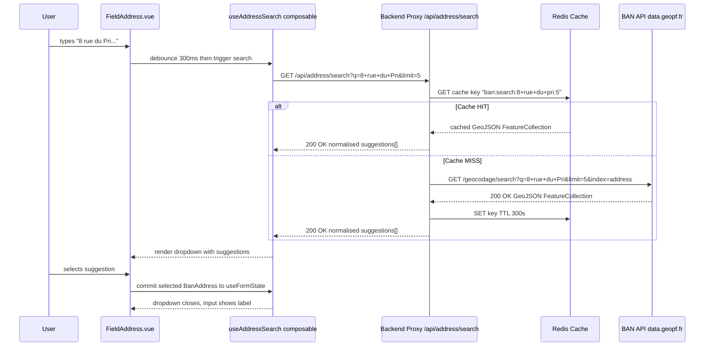
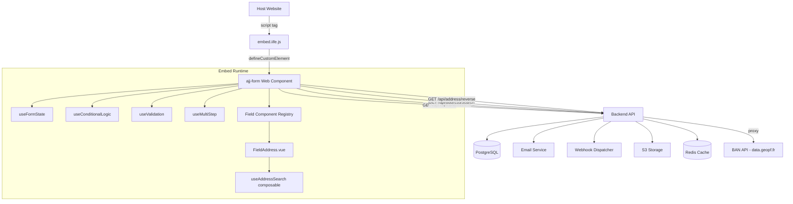

# BAN Address Integration — AJJ Custom Form Solution

Integration of the French Government Base Adresse Nationale (BAN) geocoding service into the embeddable form runtime and backend API.

---

## Table of Contents

1. [Overview](#1-overview)
2. [Architecture Integration](#2-architecture-integration)
3. [API Reference Summary](#3-api-reference-summary)
4. [Frontend Address Field Component](#4-frontend-address-field-component)
5. [Backend Proxy Service](#5-backend-proxy-service)
6. [Data Model](#6-data-model)
7. [Error Handling and Fallback Strategy](#7-error-handling-and-fallback-strategy)
8. [Performance Considerations](#8-performance-considerations)
9. [Testing Strategy](#9-testing-strategy)
10. [Security Considerations](#10-security-considerations)
11. [References](#11-references)

---

## 1. Overview

### What is the Base Adresse Nationale?

The **Base Adresse Nationale** (BAN) is the official, authoritative, and exhaustive open database of all postal addresses on French territory. It is produced collaboratively by national institutions — primarily the **Institut national de l'information géographique et forestière (IGN)** and the **Agence nationale de cohésion des territoires (ANCT)** — together with local authorities (communes) who hold the legal competence for addressing in France. Every address in the BAN is officially recognised by the French administration.

The BAN is one of the nine reference datasets of the French public data service (`service public de la donnée`). It is updated weekly from authoritative local address databases (Bases Adresses Locales — BAL). The dataset contains over 27 million addresses across metropolitan France and overseas territories, structured with house number, street name, postal code, INSEE commune code, arrondissement (for Paris, Lyon, and Marseille), geographic context (department and region), and precise WGS84 coordinates.

### Licensing and Open-Source Status

The BAN and its API are released under the **Licence Ouverte / Open Licence 2.0 (Etalab 2.0)**, which is compatible with CC BY 2.0 and the Open Government Licence. This means:

- **Free to use** for any purpose, commercial or non-commercial.
- **No API key required** for standard unit queries.
- **Attribution required**: `Source: Base Adresse Nationale — IGN / Etalab`.
- The geocoding engine (Addok) and the API code are published as open source at `https://gitlab.gpf-tech.ign.fr/geoplateforme/geocodage/geocodeur/`.

The API is operated by IGN within the **Géoplateforme** infrastructure, which replaced the previous DINUM-operated endpoint (`api-adresse.data.gouv.fr`). The current canonical base URL is `https://data.geopf.fr/geocodage/`. The legacy URL `api-adresse.data.gouv.fr` remains compatible for `/search/` and `/reverse/` calls but will be decommissioned in January 2026; all new integrations must target `data.geopf.fr`.

### Why BAN was Chosen

The BAN is the correct choice for French address autocomplete in a form solution for the following reasons:

- **Official and authoritative**: it is the only dataset recognised by French law as the reference for postal addressing.
- **No cost and no API key**: removes a dependency on third-party commercial geocoding services (Google Maps, Mapbox, HERE) that carry per-query pricing, API key rotation complexity, and GDPR implications of sending user inputs to a US-hosted service.
- **High availability**: the Géoplateforme reports 100% availability; the API processes hundreds of millions of calls per month.
- **GDPR-friendly**: data stays within French public infrastructure; no user data is transferred to private commercial entities.
- **Geocoordinates included**: every address result includes precise WGS84 longitude/latitude, enabling downstream map display without an additional geocoding step.
- **Self-hostable**: the Addok engine can be deployed on private infrastructure using Docker and BAN data dumps, providing a fallback that is entirely independent of external connectivity.

### Fit Within the Form Solution Architecture

Within the AJJ custom form solution described in [`Docs/Architecture.md`](./Architecture.md), the BAN integration adds a new **address field type** (`ADDRESS`) to the field component registry. The field renders as a text input with a debounced autocomplete dropdown. Address queries are not made directly from the browser to the BAN API — they are proxied through a new backend route (`GET /api/address/search`) that handles caching, rate limit headroom management, and response normalisation. The resolved address is stored as a structured object in the form's state map alongside all other field values and submitted as part of the standard `POST /api/submissions` payload.

---

## 2. Architecture Integration

### Where the Integration Sits

The BAN integration touches three layers of the existing architecture:

| Layer | New Element | Purpose |
|---|---|---|
| **Embed Runtime** | `FieldAddress.vue` component | Renders the autocomplete input and suggestion dropdown; manages local typing state |
| **Embed Runtime** | `useAddressSearch.ts` composable | Debounced fetch, suggestion list state, keyboard navigation state |
| **Backend API** | `GET /api/address/search` route | Proxies queries to `data.geopf.fr`; applies caching and rate-limit headroom |
| **Backend API** | `GET /api/address/reverse` route | Proxies reverse geocoding; used for GPS-based pre-fill |
| **Backend API** | Redis | Caches BAN responses to reduce upstream calls and absorb bursts |

### Why a Backend Proxy is Required

Calling the BAN API directly from the browser (`fetch('https://data.geopf.fr/geocodage/search?q=...')`) is technically possible in some contexts but is architecturally unsound for this solution for four specific reasons:

**1. CORS**: The `data.geopf.fr` endpoint does not guarantee permissive CORS headers for arbitrary host origins. The embed widget runs inside a Shadow DOM on a host page whose origin is unknown at build time. A backend proxy serves from a single known origin (`https://forms.ajj.com`) with correct CORS headers for the embed's own domain, removing this dependency entirely.

**2. Rate limiting attribution**: The BAN API rate limit is 50 requests per second **per IP address**. If the address field is embedded on a high-traffic page (e.g., an e-commerce checkout) and hundreds of users are typing simultaneously, all their requests originate from different end-user IPs — which is fine. However, in some deployment topologies (corporate proxies, certain CDN configurations), requests may arrive at the BAN API from a small number of shared egress IPs, causing spurious 429 errors. The backend proxy presents a single, well-known egress IP and manages headroom explicitly, returning cached responses for repeated queries and absorbing bursts without propagating rate-limit errors to users.

**3. Caching**: Browser caching of API responses is unreliable across form instances and browsers. Server-side Redis caching at the proxy layer provides a shared cache that benefits all concurrent users filling the same or similar addresses, dramatically reducing upstream call volume.

**4. Response normalisation and future-proofing**: If the BAN API changes its response schema (as it did during the DINUM→IGN migration in 2023–2024), a backend proxy localises the breaking change to a single file rather than requiring a redeployment of the embed bundle.

### Data Flow Diagram



### Updated Architecture Overview

The integration extends [`Docs/Architecture.md`](./Architecture.md) with the following additions (shown in context):



---

## 3. API Reference Summary

### Base URL

```
https://data.geopf.fr/geocodage/
```

The legacy base URL `https://api-adresse.data.gouv.fr/` is **backward compatible** for `/search/` and `/reverse/` but will be decommissioned in January 2026. All integration code in this document targets `data.geopf.fr`.

### Rate Limits

| Limit | Value |
|---|---|
| Unit calls | 50 requests / second / IP |
| HTTP status on breach | `429 Too Many Requests` |
| `Retry-After` header | Present; value decrements from 5 seconds after the overload ceases |
| Bulk CSV geocoding | 1 simultaneous call / IP |

---

### 3.1 Direct Geocoding — `GET /geocodage/search`

Searches for addresses, points of interest, or cadastral parcels matching a free-text query.

**Full URL:**

```
https://data.geopf.fr/geocodage/search
```

**HTTP Method:** `GET`

**Query Parameters:**

| Parameter | Type | Required | Description |
|---|---|---|---|
| `q` | `string` | **Yes** | Free-text search query. Example: `8 rue du Printemps Paris` |
| `index` | `string` | No | Index to search: `address` (default), `poi`, `parcel`. Multiple values comma-separated. |
| `limit` | `integer` | No | Maximum number of results returned. Default: `5`. Maximum: `20`. |
| `autocomplete` | `boolean` | No | Enables prefix matching for autocompletion. Default: `1` (enabled). Set to `0` to require complete words. |
| `lat` | `number` | No | Latitude of a reference point used to prioritise geographically close results. WGS84. |
| `lon` | `number` | No | Longitude of a reference point. WGS84. Must be provided together with `lat`. |
| `type` | `string` | No | Filter results by address type. Values: `housenumber`, `street`, `locality`, `municipality`. |
| `postcode` | `string` | No | Filter results to a specific postal code. |
| `citycode` | `string` | No | Filter results to a specific INSEE commune code. |
| `city` | `string` | No | Filter results to a specific city name. |
| `category` | `string` | No | Filter by POI category (only effective when `index=poi`). See `getCapabilities`. |

**Example Request:**

```
GET https://data.geopf.fr/geocodage/search?q=8+rue+du+Printemps+Paris&limit=5&index=address
```

**Example Response (GeoJSON FeatureCollection):**

```json
{
  "type": "FeatureCollection",
  "version": "0.8",
  "features": [
    {
      "type": "Feature",
      "geometry": {
        "type": "Point",
        "coordinates": [2.301538, 48.878771]
      },
      "properties": {
        "label": "8 Rue du Printemps 75017 Paris",
        "score": 0.97,
        "id": "75117_7621_00008",
        "type": "housenumber",
        "name": "8 Rue du Printemps",
        "housenumber": "8",
        "street": "Rue du Printemps",
        "postcode": "75017",
        "citycode": "75117",
        "city": "Paris",
        "district": "Paris 17e Arrondissement",
        "context": "75, Paris, Île-de-France",
        "importance": 0.68
      }
    }
  ],
  "attribution": "BAN",
  "licence": "ETALAB-2.0",
  "query": "8 rue du Printemps Paris",
  "limit": 5
}
```

**Response Fields (per feature `properties`):**

| Field | Type | Description |
|---|---|---|
| `label` | `string` | Full human-readable address label. Use this as the display string. |
| `score` | `number` | Relevance score between 0 and 1. Higher is more relevant. |
| `id` | `string` | Unique BAN identifier for this address point. |
| `type` | `string` | Result type: `housenumber`, `street`, `locality`, `municipality`. |
| `name` | `string` | Street name including house number if applicable. |
| `housenumber` | `string` | House number with any repetition indicator (e.g. `8bis`). |
| `street` | `string` | Street name without the house number. |
| `postcode` | `string` | Five-digit French postal code. |
| `citycode` | `string` | Five-digit INSEE commune code. Unique national identifier for the commune. |
| `city` | `string` | Commune name. |
| `district` | `string` | Arrondissement name (Paris, Lyon, Marseille only). Otherwise absent. |
| `context` | `string` | Department number, department name, and region name (e.g. `75, Paris, Île-de-France`). |
| `importance` | `number` | Relative importance of the address in the dataset (used for ranking). |
| `coordinates` | `[number, number]` | GeoJSON geometry coordinates: `[longitude, latitude]` in WGS84. |

---

### 3.2 Reverse Geocoding — `GET /geocodage/reverse`

Returns the nearest address (or other entity) to a given set of WGS84 coordinates.

**Full URL:**

```
https://data.geopf.fr/geocodage/reverse
```

**HTTP Method:** `GET`

**Query Parameters:**

| Parameter | Type | Required | Description |
|---|---|---|---|
| `lat` | `number` | **Yes** | Latitude of the query point (WGS84). |
| `lon` | `number` | **Yes** | Longitude of the query point (WGS84). |
| `index` | `string` | No | Index to search: `address` (default), `poi`, `parcel`. |
| `limit` | `integer` | No | Maximum number of results. Default: `1`. Maximum: `20`. |
| `type` | `string` | No | Filter by address type: `housenumber`, `street`, `locality`, `municipality`. |
| `postcode` | `string` | No | Filter results to a specific postal code. |
| `citycode` | `string` | No | Filter results to a specific INSEE commune code. |

**Example Request:**

```
GET https://data.geopf.fr/geocodage/reverse?lon=2.3488&lat=48.8534&index=address&limit=1
```

**Example Response:**

```json
{
  "type": "FeatureCollection",
  "version": "0.8",
  "features": [
    {
      "type": "Feature",
      "geometry": {
        "type": "Point",
        "coordinates": [2.3488, 48.8534]
      },
      "properties": {
        "label": "75001 Paris",
        "score": 0.99,
        "id": "75056",
        "type": "municipality",
        "name": "Paris",
        "postcode": "75001",
        "citycode": "75056",
        "city": "Paris",
        "context": "75, Paris, Île-de-France",
        "importance": 0.95
      }
    }
  ],
  "attribution": "BAN",
  "licence": "ETALAB-2.0"
}
```

---

### 3.3 Capabilities — `GET /geocodage/getcapabilities`

Returns a machine-readable description of the API's available indexes, supported parameters, and POI categories. Not used at runtime; used during development to discover available `category` filter values for POI searches.

**Full URL:**

```
https://data.geopf.fr/geocodage/getcapabilities
```

**HTTP Method:** `GET`  
**Parameters:** None.

---

### 3.4 Error Responses

| HTTP Status | Meaning | Action |
|---|---|---|
| `200 OK` | Success; `features` array may be empty if no results match. | Render dropdown or show "no results" message. |
| `400 Bad Request` | Malformed query (e.g. missing required `q` or coordinates). | Log and return fallback to free-text. |
| `429 Too Many Requests` | Rate limit exceeded. `Retry-After` header present. | Back off and retry after the indicated delay. |
| `500 Internal Server Error` | BAN infrastructure error. | Fall back to free-text; log for monitoring. |
| `503 Service Unavailable` | Temporary BAN maintenance. | Fall back to free-text; retry after 10 seconds. |

---

## 4. Frontend Address Field Component

### 4.1 Component Overview

`FieldAddress.vue` is a Vue 3 single-file component registered in the field component registry under `FieldTypeEnum.ADDRESS`. It replaces a plain text input with a debounced autocomplete widget that calls the backend proxy and renders a keyboard-navigable suggestion dropdown. On selection, the full structured BAN address object is written into `useFormState`.

### 4.2 Behaviour Specification

| Behaviour | Value | Rationale |
|---|---|---|
| Debounce delay | 300 ms | Balances responsiveness with request volume; standard for address autocomplete |
| Minimum character threshold | 3 characters | Prevents uninformative results for single letters or two-character inputs |
| Maximum suggestions rendered | 5 | Matches BAN API default; sufficient for disambiguation without overwhelming the user |
| Dropdown closes on | Selection, Escape key, outside click | Standard autocomplete UX pattern |
| Input value on selection | `properties.label` | The full formatted address string as the visible value |
| Stored value on selection | Full `BanAddress` object | Preserves all structured fields for submission |
| Fallback on API failure | Input becomes a plain free-text field | Degrades gracefully; no broken UI |

### 4.3 Accessibility Specification

The autocomplete dropdown implements the **ARIA combobox pattern** (WAI-ARIA 1.2, role `combobox`):

| Element | ARIA Attribute | Value |
|---|---|---|
| `<input>` | `role` | `combobox` |
| `<input>` | `aria-autocomplete` | `list` |
| `<input>` | `aria-expanded` | `"true"` when dropdown is open, `"false"` when closed |
| `<input>` | `aria-controls` | ID of the listbox element |
| `<input>` | `aria-activedescendant` | ID of the currently highlighted suggestion, or empty string |
| `<ul>` (listbox) | `role` | `listbox` |
| `<li>` (each suggestion) | `role` | `option` |
| `<li>` (each suggestion) | `aria-selected` | `"true"` for the highlighted item |
| `<li>` (each suggestion) | `id` | Unique ID referenced by `aria-activedescendant` |

**Keyboard navigation:**

| Key | Behaviour |
|---|---|
| `ArrowDown` | Move highlight to next suggestion (wraps to first) |
| `ArrowUp` | Move highlight to previous suggestion (wraps to last) |
| `Enter` | Select highlighted suggestion |
| `Escape` | Close dropdown; restore previous input value |
| `Tab` | Select highlighted suggestion if open, otherwise move to next field |

### 4.4 Complete Implementation

```typescript
// embed/src/components/fields/FieldAddress.vue
// Vue 3 Composition API — Address autocomplete field
// Calls backend proxy /api/address/search (never BAN API directly)

<template>
  <div class="field-address" :class="{ 'field-address--error': hasError }">
    <!-- Label -->
    <label :for="inputId" class="field-label">
      {{ field.label }}
      <span v-if="field.required" class="field-required" aria-hidden="true">*</span>
    </label>

    <!-- Description -->
    <p v-if="field.description" :id="descId" class="field-description">
      {{ field.description }}
    </p>

    <!-- Combobox container -->
    <div class="field-address__combobox">
      <input
        :id="inputId"
        ref="inputRef"
        v-model="inputValue"
        type="text"
        class="field-address__input"
        :placeholder="field.config.placeholder || 'Start typing an address...'"
        :aria-describedby="field.description ? descId : undefined"
        :aria-required="field.required"
        role="combobox"
        aria-autocomplete="list"
        :aria-expanded="isOpen ? 'true' : 'false'"
        :aria-controls="listboxId"
        :aria-activedescendant="activeDescendant"
        autocomplete="off"
        spellcheck="false"
        @input="onInput"
        @keydown="onKeydown"
        @blur="onBlur"
      />

      <!-- Loading spinner -->
      <span v-if="isLoading" class="field-address__spinner" aria-hidden="true" />

      <!-- Clear button — shown when a selection has been committed -->
      <button
        v-if="committedAddress"
        type="button"
        class="field-address__clear"
        aria-label="Clear address"
        @mousedown.prevent="clearSelection"
      >
        ×
      </button>

      <!-- Suggestion dropdown -->
      <ul
        v-show="isOpen"
        :id="listboxId"
        role="listbox"
        class="field-address__listbox"
        aria-label="Address suggestions"
      >
        <li
          v-for="(suggestion, index) in suggestions"
          :key="suggestion.id"
          :id="`${listboxId}-opt-${index}`"
          role="option"
          :aria-selected="highlightedIndex === index ? 'true' : 'false'"
          class="field-address__option"
          :class="{ 'field-address__option--highlighted': highlightedIndex === index }"
          @mousedown.prevent="selectSuggestion(suggestion)"
          @mouseover="highlightedIndex = index"
        >
          <!-- Primary label: full address string -->
          <span class="field-address__option-label">{{ suggestion.label }}</span>
          <!-- Secondary context: department and region -->
          <span class="field-address__option-context">{{ suggestion.context }}</span>
        </li>

        <!-- No results message -->
        <li
          v-if="suggestions.length === 0 && hasSearched && !isLoading"
          class="field-address__option field-address__option--empty"
          role="option"
          aria-disabled="true"
        >
          No addresses found. You may type your address manually.
        </li>
      </ul>
    </div>

    <!-- Validation error -->
    <p v-if="hasError" :id="`${inputId}-error`" class="field-error" role="alert">
      {{ errorMessage }}
    </p>

    <!-- Attribution required by Etalab 2.0 licence -->
    <p class="field-address__attribution">
      Source: Base Adresse Nationale — IGN / Etalab 2.0
    </p>
  </div>
</template>

<script setup lang="ts">
import { ref, computed, inject, watch, onMounted, onBeforeUnmount } from 'vue'
import type { FieldDefinition } from '../../types/fields'
import type { BanSuggestion, BanAddress } from '../../types/schema'
import { FORM_STATE_KEY, VALIDATION_ERRORS_KEY } from '../../composables/useFormState'

// ── Props ──────────────────────────────────────────────────────────────────
const props = defineProps<{
  field: FieldDefinition
}>()

// ── Injected state from useFormState / useValidation ──────────────────────
const formState = inject(FORM_STATE_KEY) as Map<string, unknown>
const validationErrors = inject(VALIDATION_ERRORS_KEY) as Map<string, string>

// ── Stable element IDs ────────────────────────────────────────────────────
const inputId = computed(() => `ajj-field-${props.field.id}`)
const descId = computed(() => `${inputId.value}-desc`)
const listboxId = computed(() => `${inputId.value}-listbox`)

// ── Component state ───────────────────────────────────────────────────────
const inputRef = ref<HTMLInputElement | null>(null)
const inputValue = ref<string>('')          // Current text in the input
const suggestions = ref<BanSuggestion[]>([]) // Current suggestion list
const highlightedIndex = ref<number>(-1)    // Keyboard-highlighted option
const isOpen = ref<boolean>(false)          // Dropdown visibility
const isLoading = ref<boolean>(false)       // Fetch in-flight indicator
const hasSearched = ref<boolean>(false)     // True after at least one search
const committedAddress = ref<BanAddress | null>(null) // Last confirmed selection

// Debounce timer handle
let debounceTimer: ReturnType<typeof setTimeout> | null = null

// Minimum characters before triggering a search
const MIN_CHARS = 3

// Debounce delay in milliseconds
const DEBOUNCE_MS = 300

// ── Derived state ─────────────────────────────────────────────────────────
const errorMessage = computed(() => validationErrors.get(props.field.id) ?? '')
const hasError = computed(() => !!errorMessage.value)

const activeDescendant = computed(() => {
  if (!isOpen.value || highlightedIndex.value < 0) return ''
  return `${listboxId.value}-opt-${highlightedIndex.value}`
})

// ── Initialise from existing form state (e.g. prefill) ────────────────────
onMounted(() => {
  const existing = formState.get(props.field.id) as BanAddress | string | undefined
  if (existing) {
    if (typeof existing === 'object' && existing.label) {
      committedAddress.value = existing
      inputValue.value = existing.label
    } else if (typeof existing === 'string') {
      inputValue.value = existing
    }
  }
})

// ── Input handler ─────────────────────────────────────────────────────────
function onInput(): void {
  // If user edits the input after a selection, clear the committed address
  if (committedAddress.value) {
    committedAddress.value = null
    formState.set(props.field.id, inputValue.value)
  }

  if (debounceTimer !== null) {
    clearTimeout(debounceTimer)
  }

  if (inputValue.value.length < MIN_CHARS) {
    closeSuggestions()
    return
  }

  debounceTimer = setTimeout(() => {
    fetchSuggestions(inputValue.value)
  }, DEBOUNCE_MS)
}

// ── Fetch suggestions via backend proxy ───────────────────────────────────
async function fetchSuggestions(query: string): Promise<void> {
  isLoading.value = true
  hasSearched.value = true

  try {
    const params = new URLSearchParams({
      q: query,
      limit: '5',
    })
    const response = await fetch(`/api/address/search?${params.toString()}`, {
      headers: { Accept: 'application/json' },
    })

    if (!response.ok) {
      // Non-2xx: degrade to free-text; do not throw visibly
      handleApiFailure()
      return
    }

    const data: BanSuggestion[] = await response.json()
    suggestions.value = data
    isOpen.value = data.length > 0
    highlightedIndex.value = -1
  } catch {
    // Network error or parse failure
    handleApiFailure()
  } finally {
    isLoading.value = false
  }
}

// ── Keyboard navigation ───────────────────────────────────────────────────
function onKeydown(event: KeyboardEvent): void {
  if (!isOpen.value) return

  switch (event.key) {
    case 'ArrowDown':
      event.preventDefault()
      highlightedIndex.value =
        highlightedIndex.value < suggestions.value.length - 1
          ? highlightedIndex.value + 1
          : 0
      break

    case 'ArrowUp':
      event.preventDefault()
      highlightedIndex.value =
        highlightedIndex.value > 0
          ? highlightedIndex.value - 1
          : suggestions.value.length - 1
      break

    case 'Enter':
      event.preventDefault()
      if (highlightedIndex.value >= 0) {
        selectSuggestion(suggestions.value[highlightedIndex.value])
      }
      break

    case 'Escape':
      closeSuggestions()
      break

    case 'Tab':
      if (highlightedIndex.value >= 0) {
        selectSuggestion(suggestions.value[highlightedIndex.value])
      }
      break
  }
}

// ── Select a suggestion ───────────────────────────────────────────────────
function selectSuggestion(suggestion: BanSuggestion): void {
  const address: BanAddress = {
    label: suggestion.label,
    housenumber: suggestion.housenumber ?? null,
    street: suggestion.street ?? null,
    postcode: suggestion.postcode,
    citycode: suggestion.citycode,
    city: suggestion.city,
    district: suggestion.district ?? null,
    context: suggestion.context,
    score: suggestion.score,
    longitude: suggestion.longitude,
    latitude: suggestion.latitude,
    type: suggestion.type,
    banId: suggestion.id,
  }

  committedAddress.value = address
  inputValue.value = suggestion.label

  // Write structured object to shared form state
  formState.set(props.field.id, address)

  closeSuggestions()
  inputRef.value?.focus()
}

// ── Clear selection ───────────────────────────────────────────────────────
function clearSelection(): void {
  committedAddress.value = null
  inputValue.value = ''
  formState.set(props.field.id, '')
  suggestions.value = []
  hasSearched.value = false
  isOpen.value = false
  inputRef.value?.focus()
}

// ── Blur handler ──────────────────────────────────────────────────────────
function onBlur(): void {
  // Delay close to allow mousedown on a suggestion to fire first
  setTimeout(() => {
    if (!committedAddress.value && inputValue.value) {
      // User typed something but did not select — store as free text
      formState.set(props.field.id, inputValue.value)
    }
    closeSuggestions()
  }, 150)
}

// ── Close dropdown ────────────────────────────────────────────────────────
function closeSuggestions(): void {
  isOpen.value = false
  highlightedIndex.value = -1
}

// ── API failure — degrade to free-text ───────────────────────────────────
function handleApiFailure(): void {
  suggestions.value = []
  isOpen.value = false
  isLoading.value = false
  // The input continues to work as a plain text field
  formState.set(props.field.id, inputValue.value)
}

// ── Cleanup ───────────────────────────────────────────────────────────────
onBeforeUnmount(() => {
  if (debounceTimer !== null) {
    clearTimeout(debounceTimer)
  }
})
</script>
```

---

## 5. Backend Proxy Service

### 5.1 Route Definition

Two new routes are added to `api/src/routes/address.ts` and mounted on the Express/Fastify app:

```
GET /api/address/search   — proxies /geocodage/search
GET /api/address/reverse  — proxies /geocodage/reverse
```

These routes sit behind the existing `originCheck` and `rateLimit` middleware, the same as the submissions endpoint. They do **not** require JWT authentication since they serve the public embed widget.

### 5.2 Complete Implementation

```typescript
// api/src/routes/address.ts
// Backend proxy for BAN Géoplateforme geocoding API.
// Never called directly from the browser — always via this proxy.

import type { FastifyInstance, FastifyRequest, FastifyReply } from 'fastify'
import { createClient } from 'redis'

// ── Constants ──────────────────────────────────────────────────────────────
const BAN_BASE_URL = 'https://data.geopf.fr/geocodage'

// Redis TTL for cached search responses (seconds)
const CACHE_TTL_SEARCH = 300   // 5 minutes — queries don't change frequently
const CACHE_TTL_REVERSE = 600  // 10 minutes — reverse results are very stable

// Maximum query length to accept — prevents oversized upstream requests
const MAX_QUERY_LENGTH = 200

// ── Types ──────────────────────────────────────────────────────────────────
interface BanFeatureProperties {
  label: string
  score: number
  id: string
  type: string
  name: string
  housenumber?: string
  street?: string
  postcode: string
  citycode: string
  city: string
  district?: string
  context: string
  importance?: number
}

interface BanFeature {
  type: 'Feature'
  geometry: { type: 'Point'; coordinates: [number, number] }
  properties: BanFeatureProperties
}

interface BanFeatureCollection {
  type: 'FeatureCollection'
  features: BanFeature[]
  attribution: string
  licence: string
}

// Normalised suggestion returned to the frontend — flattened from GeoJSON
interface NormalisedSuggestion {
  id: string
  label: string
  score: number
  type: string
  housenumber: string | null
  street: string | null
  postcode: string
  citycode: string
  city: string
  district: string | null
  context: string
  longitude: number
  latitude: number
}

// ── Helper: normalise a BAN GeoJSON response ──────────────────────────────
function normaliseFeatures(collection: BanFeatureCollection): NormalisedSuggestion[] {
  return collection.features.map((feature) => {
    const p = feature.properties
    const [lon, lat] = feature.geometry.coordinates
    return {
      id: p.id,
      label: p.label,
      score: p.score,
      type: p.type,
      housenumber: p.housenumber ?? null,
      street: p.street ?? null,
      postcode: p.postcode,
      citycode: p.citycode,
      city: p.city,
      district: p.district ?? null,
      context: p.context,
      longitude: lon,
      latitude: lat,
    }
  })
}

// ── Helper: build a deterministic Redis cache key ─────────────────────────
function buildCacheKey(endpoint: string, params: URLSearchParams): string {
  // Sort params so that key is independent of parameter order
  const sorted = new URLSearchParams([...params.entries()].sort())
  return `ban:${endpoint}:${sorted.toString().toLowerCase()}`
}

// ── Plugin registration ───────────────────────────────────────────────────
export async function addressRoutes(
  fastify: FastifyInstance,
  redis: ReturnType<typeof createClient>
): Promise<void> {

  // ── GET /api/address/search ──────────────────────────────────────────────
  fastify.get(
    '/api/address/search',
    async (
      request: FastifyRequest<{ Querystring: { q?: string; limit?: string } }>,
      reply: FastifyReply
    ) => {
      const { q, limit = '5' } = request.query

      // ── Input validation ─────────────────────────────────────────────────
      if (!q || typeof q !== 'string' || q.trim().length === 0) {
        return reply.code(400).send({ error: 'Query parameter "q" is required.' })
      }

      // Sanitise: strip any HTML tags or script injection attempts
      const sanitisedQuery = q
        .trim()
        .replace(/<[^>]*>/g, '')           // strip HTML tags
        .replace(/[<>"'`]/g, '')           // strip dangerous characters
        .slice(0, MAX_QUERY_LENGTH)        // enforce max length

      if (sanitisedQuery.length < 3) {
        return reply.code(400).send({ error: 'Query must be at least 3 characters.' })
      }

      // Clamp limit to [1, 20]
      const parsedLimit = Math.min(20, Math.max(1, parseInt(limit, 10) || 5))

      // ── Cache lookup ─────────────────────────────────────────────────────
      const upstreamParams = new URLSearchParams({
        q: sanitisedQuery,
        limit: String(parsedLimit),
        index: 'address',
        autocomplete: '1',
      })
      const cacheKey = buildCacheKey('search', upstreamParams)

      try {
        const cached = await redis.get(cacheKey)
        if (cached) {
          return reply
            .code(200)
            .header('Content-Type', 'application/json')
            .header('X-Cache', 'HIT')
            .send(cached)
        }
      } catch {
        // Redis unavailable — proceed without cache; log for monitoring
        fastify.log.warn('Redis unavailable for BAN cache lookup')
      }

      // ── Upstream request to BAN API ──────────────────────────────────────
      let banResponse: Response
      try {
        banResponse = await fetch(
          `${BAN_BASE_URL}/search?${upstreamParams.toString()}`,
          {
            headers: {
              Accept: 'application/geo+json',
              'User-Agent': 'AJJ-Tally/1.0 (forms.ajj.com)',
            },
            signal: AbortSignal.timeout(5000), // 5-second timeout
          }
        )
      } catch (fetchError: unknown) {
        // Network error or timeout
        fastify.log.error({ err: fetchError }, 'BAN API request failed')
        return reply.code(503).send({
          error: 'Address service temporarily unavailable.',
          fallback: true,
        })
      }

      // ── Handle upstream errors ───────────────────────────────────────────
      if (banResponse.status === 429) {
        const retryAfter = banResponse.headers.get('retry-after') ?? '5'
        return reply
          .code(429)
          .header('Retry-After', retryAfter)
          .send({ error: 'Rate limit exceeded. Retry shortly.', fallback: true })
      }

      if (!banResponse.ok) {
        fastify.log.error(
          { status: banResponse.status },
          'BAN API returned non-2xx response'
        )
        return reply.code(502).send({
          error: 'Upstream address service error.',
          fallback: true,
        })
      }

      // ── Parse and normalise ──────────────────────────────────────────────
      let collection: BanFeatureCollection
      try {
        collection = (await banResponse.json()) as BanFeatureCollection
      } catch {
        return reply.code(502).send({ error: 'Invalid upstream response.', fallback: true })
      }

      const normalised: NormalisedSuggestion[] = normaliseFeatures(collection)
      const responseBody = JSON.stringify(normalised)

      // ── Store in cache ───────────────────────────────────────────────────
      try {
        await redis.set(cacheKey, responseBody, { EX: CACHE_TTL_SEARCH })
      } catch {
        fastify.log.warn('Redis unavailable for BAN cache write')
      }

      return reply
        .code(200)
        .header('Content-Type', 'application/json')
        .header('X-Cache', 'MISS')
        .send(responseBody)
    }
  )

  // ── GET /api/address/reverse ─────────────────────────────────────────────
  fastify.get(
    '/api/address/reverse',
    async (
      request: FastifyRequest<{ Querystring: { lat?: string; lon?: string; limit?: string } }>,
      reply: FastifyReply
    ) => {
      const { lat, lon, limit = '1' } = request.query

      // ── Input validation ─────────────────────────────────────────────────
      const parsedLat = parseFloat(lat ?? '')
      const parsedLon = parseFloat(lon ?? '')

      if (
        isNaN(parsedLat) || isNaN(parsedLon) ||
        parsedLat < -90 || parsedLat > 90 ||
        parsedLon < -180 || parsedLon > 180
      ) {
        return reply.code(400).send({
          error: 'Valid "lat" (−90 to 90) and "lon" (−180 to 180) parameters are required.',
        })
      }

      const parsedLimit = Math.min(10, Math.max(1, parseInt(limit, 10) || 1))

      // ── Cache lookup ─────────────────────────────────────────────────────
      const upstreamParams = new URLSearchParams({
        lat: parsedLat.toFixed(6),
        lon: parsedLon.toFixed(6),
        limit: String(parsedLimit),
        index: 'address',
      })
      const cacheKey = buildCacheKey('reverse', upstreamParams)

      try {
        const cached = await redis.get(cacheKey)
        if (cached) {
          return reply.code(200).header('Content-Type', 'application/json')
            .header('X-Cache', 'HIT').send(cached)
        }
      } catch {
        fastify.log.warn('Redis unavailable for BAN reverse cache lookup')
      }

      // ── Upstream request ─────────────────────────────────────────────────
      let banResponse: Response
      try {
        banResponse = await fetch(
          `${BAN_BASE_URL}/reverse?${upstreamParams.toString()}`,
          {
            headers: { Accept: 'application/geo+json', 'User-Agent': 'AJJ-Tally/1.0' },
            signal: AbortSignal.timeout(5000),
          }
        )
      } catch (err) {
        fastify.log.error({ err }, 'BAN reverse API request failed')
        return reply.code(503).send({ error: 'Address service unavailable.', fallback: true })
      }

      if (!banResponse.ok) {
        return reply.code(502).send({ error: 'Upstream reverse geocoding error.', fallback: true })
      }

      let collection: BanFeatureCollection
      try {
        collection = (await banResponse.json()) as BanFeatureCollection
      } catch {
        return reply.code(502).send({ error: 'Invalid upstream response.', fallback: true })
      }

      const normalised = normaliseFeatures(collection)
      const responseBody = JSON.stringify(normalised)

      try {
        await redis.set(cacheKey, responseBody, { EX: CACHE_TTL_REVERSE })
      } catch {
        fastify.log.warn('Redis unavailable for BAN reverse cache write')
      }

      return reply.code(200).header('Content-Type', 'application/json')
        .header('X-Cache', 'MISS').send(responseBody)
    }
  )
}
```

### 5.3 Cache Key Strategy

Cache keys follow the pattern `ban:{endpoint}:{sorted-url-params}`. Parameters are lower-cased and alphabetically sorted before hashing to ensure that `q=8+rue+du+Printemps` and `q=8+Rue+Du+Printemps` produce the same cache key. This avoids redundant upstream calls for case-variant queries.

| Parameter | Normalisation applied |
|---|---|
| `q` | `.trim().toLowerCase()` |
| `lat` / `lon` | Rounded to 6 decimal places (~11 cm precision) |
| `limit` | Integer-clamped to `[1, 20]` |

### 5.4 Rate Limiting

The `/api/address/search` and `/api/address/reverse` routes are included under the existing Redis-backed rate limiter defined in `api/src/middleware/rateLimit.ts`. The per-IP limit for address endpoints is configured separately from the submission endpoint:

| Route | Limit |
|---|---|
| `POST /api/submissions` | 5 requests / IP / minute |
| `GET /api/address/search` | 60 requests / IP / minute |
| `GET /api/address/reverse` | 30 requests / IP / minute |

This allows rapid autocomplete queries (one per keystroke burst) without sharing quota with submission processing.

---

## 6. Data Model

### 6.1 TypeScript Interface

```typescript
// embed/src/types/schema.ts — additions for BAN address integration

/**
 * A single address suggestion returned by the backend proxy.
 * Normalised from BAN GeoJSON FeatureCollection.
 */
export interface BanSuggestion {
  id: string           // BAN unique address point identifier
  label: string        // Full formatted address (display string)
  score: number        // Relevance score 0–1
  type: string         // "housenumber" | "street" | "locality" | "municipality"
  housenumber: string | null   // House number (e.g. "8", "12bis")
  street: string | null        // Street name without house number
  postcode: string             // Five-digit postal code
  citycode: string             // Five-digit INSEE commune code
  city: string                 // Commune name
  district: string | null      // Arrondissement (Paris/Lyon/Marseille only)
  context: string              // "75, Paris, Île-de-France"
  longitude: number            // WGS84 longitude
  latitude: number             // WGS84 latitude
}

/**
 * A committed BAN address stored in form state and submission payload.
 * Identical structure to BanSuggestion plus banId alias for clarity.
 */
export interface BanAddress {
  banId: string                // Maps to BanSuggestion.id
  label: string
  housenumber: string | null
  street: string | null
  postcode: string
  citycode: string
  city: string
  district: string | null
  context: string
  score: number
  longitude: number
  latitude: number
  type: string
}

/**
 * When the user types freely without selecting a BAN suggestion,
 * the field falls back to a plain string stored in form state.
 * The submission service accepts both BanAddress and string for ADDRESS fields.
 */
export type AddressFieldValue = BanAddress | string
```

### 6.2 JSON Schema Definition

This schema fragment is used by the backend submission service to validate the address field value in a `POST /api/submissions` payload.

```json
{
  "$schema": "https://json-schema.org/draft/2020-12/schema",
  "$id": "https://forms.ajj.com/schemas/ban-address.json",
  "title": "BanAddress",
  "description": "A resolved address from the Base Adresse Nationale, or a free-text fallback string.",
  "oneOf": [
    {
      "type": "object",
      "required": ["banId", "label", "postcode", "citycode", "city", "longitude", "latitude"],
      "properties": {
        "banId":       { "type": "string", "description": "BAN unique address identifier" },
        "label":       { "type": "string", "minLength": 1, "maxLength": 500 },
        "housenumber": { "type": ["string", "null"], "maxLength": 20 },
        "street":      { "type": ["string", "null"], "maxLength": 200 },
        "postcode":    { "type": "string", "pattern": "^[0-9]{5}$" },
        "citycode":    { "type": "string", "pattern": "^[0-9A-Z]{5}$" },
        "city":        { "type": "string", "minLength": 1, "maxLength": 200 },
        "district":    { "type": ["string", "null"], "maxLength": 200 },
        "context":     { "type": "string", "maxLength": 300 },
        "score":       { "type": "number", "minimum": 0, "maximum": 1 },
        "longitude":   { "type": "number", "minimum": -180, "maximum": 180 },
        "latitude":    { "type": "number", "minimum": -90, "maximum": 90 },
        "type":        {
          "type": "string",
          "enum": ["housenumber", "street", "locality", "municipality"]
        }
      },
      "additionalProperties": false
    },
    {
      "type": "string",
      "description": "Free-text address fallback — used when BAN autocomplete was unavailable.",
      "minLength": 1,
      "maxLength": 500
    }
  ]
}
```

### 6.3 Mapping BAN Response Fields to Submission Schema

| BAN `properties` field | BAN `geometry` field | Submission schema field | Notes |
|---|---|---|---|
| `id` | — | `banId` | Renamed for clarity |
| `label` | — | `label` | Primary display string |
| `housenumber` | — | `housenumber` | Nullable |
| `street` | — | `street` | Nullable |
| `postcode` | — | `postcode` | 5-digit string |
| `citycode` | — | `citycode` | INSEE code |
| `city` | — | `city` | Commune name |
| `district` | — | `district` | Nullable; arrondissements only |
| `context` | — | `context` | Department + region string |
| `score` | — | `score` | Normalised 0–1 |
| — | `coordinates[0]` | `longitude` | GeoJSON long/lat order |
| — | `coordinates[1]` | `latitude` | |
| `type` | — | `type` | `housenumber` \| `street` \| etc. |

---

## 7. Error Handling and Fallback Strategy

### 7.1 Failure Scenarios and Responses

| Scenario | Detection | Frontend Behaviour | Backend Behaviour | User-Facing Message |
|---|---|---|---|---|
| BAN API unreachable (network error) | `fetch` throws `TypeError` | Input becomes plain free-text; dropdown hidden | Log error; return `503 { fallback: true }` | Silent — no error shown; input remains usable |
| BAN API timeout (> 5 seconds) | `AbortSignal.timeout(5000)` fires | Input becomes plain free-text | Log timeout; return `503 { fallback: true }` | Silent degradation |
| BAN API returns 429 | HTTP status `429` check | Retry silently after `Retry-After` seconds (max 1 retry); then degrade | Return `429` with `Retry-After` header | Silent; if second attempt fails, free-text fallback |
| BAN API returns 5xx | HTTP status `>= 500` check | Free-text fallback immediately | Log upstream status; return `502 { fallback: true }` | Silent degradation |
| Empty results (`features: []`) | `suggestions.length === 0` after successful fetch | Show "No addresses found" message in dropdown; user continues typing | Normal `200` response | "No addresses found. You may type your address manually." |
| Redis unavailable | `redis.get()` throws | Not visible to frontend | Log warning; proceed without cache; upstream call made normally | None |
| Invalid input (< 3 chars, HTML injection) | Length check + sanitisation | Dropdown not triggered; no API call | `400` returned if call is made directly | Field behaves as plain text |
| Form submission with free-text address | `typeof value === 'string'` check | No visual change | Server-side JSON Schema `oneOf` accepts string fallback | None |
| Form submission with no address entered | `useValidation` `required` check | Inline "This field is required." error | Server-side required validation blocks persistence | "This field is required." |

### 7.2 Retry Logic

The frontend `useAddressSearch` composable implements a single automatic retry only for `429 Too Many Requests` responses:

```typescript
// Inside fetchSuggestions, after a 429 response:
const retryAfterMs = (parseInt(response.headers.get('Retry-After') ?? '5', 10) + 1) * 1000
await new Promise(resolve => setTimeout(resolve, retryAfterMs))
const retryResponse = await fetch(...)
// If retry also fails, call handleApiFailure() — no further retries
```

No automatic retry is performed for `5xx` or network errors; these degrade immediately to free-text to avoid blocking the user.

### 7.3 Logging

The backend logs the following structured events for monitoring:

```typescript
// Redis cache miss (informational)
fastify.log.info({ cacheKey }, 'BAN cache MISS')

// BAN API timeout
fastify.log.error({ query: sanitisedQuery, durationMs }, 'BAN API timeout')

// BAN API non-2xx
fastify.log.error({ status: banResponse.status, query: sanitisedQuery }, 'BAN API error')

// Redis write failure (warning — non-critical)
fastify.log.warn({ cacheKey }, 'Redis BAN cache write failed')
```

---

## 8. Performance Considerations

### 8.1 Debounce Tuning

The 300 ms debounce delay is chosen as the standard for address autocomplete. Lowering it below 200 ms causes unnecessary upstream calls when a user types at normal speed (approximately 5 characters per second). Raising it above 400 ms creates a perceptible lag between stopping typing and seeing suggestions. For mobile virtual keyboards, which produce input events more slowly, 300 ms remains appropriate.

If the host site has users known to type slowly (e.g. elderly users on an accessibility form), the debounce can be raised to 500 ms by exposing a `debounce-ms` prop on the `FieldAddress` component schema config.

### 8.2 HTTP Caching Headers from the BAN API

The `data.geopf.fr` API returns standard HTTP caching headers on responses:

```
Cache-Control: max-age=300, public
ETag: "..."
```

The backend proxy explicitly **does not** rely on these headers for client-side caching because the embed widget is loaded in a Shadow DOM iframe context where browser caching behaviour for fetch calls varies across browsers. Instead, the proxy implements its own Redis cache with an explicit TTL.

The `X-Cache: HIT` / `X-Cache: MISS` response header is set on the proxy response for operational visibility.

### 8.3 Backend Cache Invalidation

The BAN dataset is updated twice per week. Cache entries have a 5-minute TTL (`CACHE_TTL_SEARCH = 300`), which means stale addresses would be served for at most 5 minutes. This is acceptable because:

- Address changes (new streets, renumbering) are infrequent.
- The 5-minute TTL naturally expires without requiring manual invalidation.
- If a known update has been released, the Redis cache can be flushed with `redis.flushDb()` or selectively with `redis.del('ban:search:*')` using a Redis key scan.

For reverse geocoding results, the TTL is set to 10 minutes (`CACHE_TTL_REVERSE = 600`) because coordinates do not change — only the address labels associated with them do, and even that is rare.

### 8.4 CDN and Edge Caching

The backend proxy endpoints are **not suitable** for CDN caching because:

- Query strings (`?q=...`) are highly variable; cache hit rates at CDN level would be near zero.
- User-typed queries may contain partial personal data (partial names, door codes); caching at CDN edge nodes outside the operator's control would create a GDPR concern.

The correct caching layer for BAN responses is the Redis instance managed within the operator's own infrastructure, as specified above.

### 8.5 Bundle Size Impact

The `FieldAddress.vue` component adds no third-party dependencies to the embed bundle. The autocomplete logic is written entirely in Vue 3 Composition API code. The only new runtime dependency is the `fetch` API, which is available natively in all supported browsers.

---

## 9. Testing Strategy

### 9.1 Frontend Unit Tests (Vitest + Vue Test Utils)

File: `embed/src/components/fields/__tests__/FieldAddress.test.ts`

```typescript
import { describe, it, expect, vi, beforeEach, afterEach } from 'vitest'
import { mount, flushPromises } from '@vue/test-utils'
import FieldAddress from '../FieldAddress.vue'
import type { FieldDefinition } from '../../../types/fields'

// Mock fetch globally
const mockFetch = vi.fn()
globalThis.fetch = mockFetch

// Minimal field definition for ADDRESS type
const fieldDef: FieldDefinition = {
  id: 'test_address',
  type: 'ADDRESS',
  label: 'Your address',
  description: null,
  required: true,
  hidden: false,
  defaultValue: null,
  validationRules: ['required'],
  config: { placeholder: 'Start typing...' },
}

// Stub form state inject
const formState = new Map()
const validationErrors = new Map()

function mountField() {
  return mount(FieldAddress, {
    props: { field: fieldDef },
    global: {
      provide: {
        'FORM_STATE_KEY': formState,
        'VALIDATION_ERRORS_KEY': validationErrors,
      },
    },
  })
}

describe('FieldAddress — autocomplete behaviour', () => {
  beforeEach(() => {
    vi.useFakeTimers()
    mockFetch.mockReset()
    formState.clear()
  })

  afterEach(() => {
    vi.useRealTimers()
  })

  it('does not call the API when fewer than 3 characters are typed', async () => {
    const wrapper = mountField()
    const input = wrapper.find('input')
    await input.setValue('Pa')
    vi.advanceTimersByTime(400)
    await flushPromises()
    expect(mockFetch).not.toHaveBeenCalled()
  })

  it('calls /api/address/search after 300ms debounce when 3+ characters are typed', async () => {
    mockFetch.mockResolvedValueOnce({
      ok: true,
      json: async () => [],
    })
    const wrapper = mountField()
    const input = wrapper.find('input')
    await input.setValue('Par')
    vi.advanceTimersByTime(299)
    expect(mockFetch).not.toHaveBeenCalled()
    vi.advanceTimersByTime(1)
    await flushPromises()
    expect(mockFetch).toHaveBeenCalledWith(
      expect.stringContaining('/api/address/search?q=Par'),
      expect.any(Object)
    )
  })

  it('renders suggestion dropdown when results are returned', async () => {
    const suggestions = [
      {
        id: '75117_7621_00008',
        label: '8 Rue du Printemps 75017 Paris',
        score: 0.97,
        type: 'housenumber',
        housenumber: '8',
        street: 'Rue du Printemps',
        postcode: '75017',
        citycode: '75117',
        city: 'Paris',
        district: null,
        context: '75, Paris, Île-de-France',
        longitude: 2.301538,
        latitude: 48.878771,
      },
    ]
    mockFetch.mockResolvedValueOnce({ ok: true, json: async () => suggestions })
    const wrapper = mountField()
    await wrapper.find('input').setValue('8 rue du Printemps')
    vi.advanceTimersByTime(300)
    await flushPromises()
    const options = wrapper.findAll('[role="option"]')
    expect(options).toHaveLength(1)
    expect(options[0].text()).toContain('8 Rue du Printemps 75017 Paris')
  })

  it('writes BanAddress object to formState when a suggestion is selected', async () => {
    const suggestion = {
      id: '75117_7621_00008',
      label: '8 Rue du Printemps 75017 Paris',
      score: 0.97, type: 'housenumber', housenumber: '8',
      street: 'Rue du Printemps', postcode: '75017', citycode: '75117',
      city: 'Paris', district: null, context: '75, Paris, Île-de-France',
      longitude: 2.301538, latitude: 48.878771,
    }
    mockFetch.mockResolvedValueOnce({ ok: true, json: async () => [suggestion] })
    const wrapper = mountField()
    await wrapper.find('input').setValue('8 rue du Printemps')
    vi.advanceTimersByTime(300)
    await flushPromises()
    await wrapper.find('[role="option"]').trigger('mousedown')
    const stored = formState.get('test_address') as Record<string, unknown>
    expect(stored.label).toBe('8 Rue du Printemps 75017 Paris')
    expect(stored.postcode).toBe('75017')
    expect(stored.longitude).toBe(2.301538)
    expect(stored.banId).toBe('75117_7621_00008')
  })

  it('degrades to free-text input when the API returns a 503', async () => {
    mockFetch.mockResolvedValueOnce({ ok: false, status: 503, json: async () => ({ fallback: true }) })
    const wrapper = mountField()
    await wrapper.find('input').setValue('Paris')
    vi.advanceTimersByTime(300)
    await flushPromises()
    // Dropdown should not be open
    const listbox = wrapper.find('[role="listbox"]')
    expect(listbox.isVisible()).toBe(false)
    // The input value should still be accessible
    expect(wrapper.find('input').element.value).toBe('Paris')
  })

  it('navigates suggestions with ArrowDown and selects with Enter', async () => {
    const suggestions = [
      { id: 'a', label: 'A 75001 Paris', score: 0.9, type: 'street', housenumber: null,
        street: 'A', postcode: '75001', citycode: '75056', city: 'Paris',
        district: null, context: '75, Paris, Île-de-France', longitude: 2.3, latitude: 48.85 },
      { id: 'b', label: 'B 75002 Paris', score: 0.8, type: 'street', housenumber: null,
        street: 'B', postcode: '75002', citycode: '75056', city: 'Paris',
        district: null, context: '75, Paris, Île-de-France', longitude: 2.31, latitude: 48.86 },
    ]
    mockFetch.mockResolvedValueOnce({ ok: true, json: async () => suggestions })
    const wrapper = mountField()
    const input = wrapper.find('input')
    await input.setValue('Paris')
    vi.advanceTimersByTime(300)
    await flushPromises()
    await input.trigger('keydown', { key: 'ArrowDown' })
    await input.trigger('keydown', { key: 'ArrowDown' })
    await input.trigger('keydown', { key: 'Enter' })
    const stored = formState.get('test_address') as Record<string, unknown>
    expect(stored.label).toBe('B 75002 Paris')
  })
})
```

### 9.2 Backend Integration Tests (Supertest / Fastify inject)

File: `api/src/routes/__tests__/address.test.ts`

```typescript
import { describe, it, expect, vi, beforeAll, afterAll } from 'vitest'
import Fastify from 'fastify'
import { addressRoutes } from '../address'

// Mock Redis client
const mockRedis = {
  get: vi.fn().mockResolvedValue(null),   // Default: cache miss
  set: vi.fn().mockResolvedValue('OK'),
}

// Mock global fetch for upstream BAN calls
const mockFetch = vi.fn()
globalThis.fetch = mockFetch

let app: ReturnType<typeof Fastify>

beforeAll(async () => {
  app = Fastify({ logger: false })
  await addressRoutes(app, mockRedis as never)
  await app.ready()
})

afterAll(async () => {
  await app.close()
})

describe('GET /api/address/search', () => {
  it('returns 400 when q is missing', async () => {
    const response = await app.inject({ method: 'GET', url: '/api/address/search' })
    expect(response.statusCode).toBe(400)
    expect(JSON.parse(response.body).error).toMatch(/required/)
  })

  it('returns 400 when q is shorter than 3 characters', async () => {
    const response = await app.inject({ method: 'GET', url: '/api/address/search?q=Pa' })
    expect(response.statusCode).toBe(400)
  })

  it('strips HTML tags from query before forwarding to BAN API', async () => {
    mockFetch.mockResolvedValueOnce({
      ok: true,
      json: async () => ({ type: 'FeatureCollection', features: [], attribution: 'BAN', licence: 'ETALAB-2.0' }),
    })
    await app.inject({ method: 'GET', url: '/api/address/search?q=<script>alert(1)</script>Paris' })
    const calledUrl = mockFetch.mock.calls[0][0] as string
    expect(calledUrl).not.toContain('<script>')
    expect(calledUrl).not.toContain('alert')
  })

  it('returns normalised suggestion array on success', async () => {
    mockFetch.mockResolvedValueOnce({
      ok: true,
      json: async () => ({
        type: 'FeatureCollection',
        features: [
          {
            type: 'Feature',
            geometry: { type: 'Point', coordinates: [2.301538, 48.878771] },
            properties: {
              label: '8 Rue du Printemps 75017 Paris', score: 0.97,
              id: '75117_7621_00008', type: 'housenumber', name: '8 Rue du Printemps',
              housenumber: '8', street: 'Rue du Printemps', postcode: '75017',
              citycode: '75117', city: 'Paris', context: '75, Paris, Île-de-France',
              importance: 0.68,
            },
          },
        ],
        attribution: 'BAN', licence: 'ETALAB-2.0',
      }),
    })
    const response = await app.inject({
      method: 'GET',
      url: '/api/address/search?q=8+rue+du+Printemps',
    })
    expect(response.statusCode).toBe(200)
    const body = JSON.parse(response.body)
    expect(Array.isArray(body)).toBe(true)
    expect(body[0].label).toBe('8 Rue du Printemps 75017 Paris')
    expect(body[0].longitude).toBe(2.301538)
    expect(body[0].latitude).toBe(48.878771)
    expect(body[0].banId).toBe('75117_7621_00008')
  })

  it('returns 503 with fallback flag when BAN API is unreachable', async () => {
    mockFetch.mockRejectedValueOnce(new TypeError('fetch failed'))
    const response = await app.inject({
      method: 'GET',
      url: '/api/address/search?q=rue+de+la+Paix',
    })
    expect(response.statusCode).toBe(503)
    expect(JSON.parse(response.body).fallback).toBe(true)
  })

  it('serves from Redis cache on repeated request', async () => {
    const cachedBody = JSON.stringify([{ id: 'cached', label: 'Cached Address', score: 1 }])
    mockRedis.get.mockResolvedValueOnce(cachedBody)
    const response = await app.inject({
      method: 'GET',
      url: '/api/address/search?q=rue+de+la+Paix',
    })
    expect(response.statusCode).toBe(200)
    expect(response.headers['x-cache']).toBe('HIT')
    expect(mockFetch).not.toHaveBeenCalledAfter(vi.fn()) // fetch not called
  })
})

describe('GET /api/address/reverse', () => {
  it('returns 400 when lat/lon are missing', async () => {
    const response = await app.inject({ method: 'GET', url: '/api/address/reverse' })
    expect(response.statusCode).toBe(400)
  })

  it('returns 400 when lat is out of range', async () => {
    const response = await app.inject({
      method: 'GET', url: '/api/address/reverse?lat=100&lon=2.3',
    })
    expect(response.statusCode).toBe(400)
  })

  it('returns normalised results for valid coordinates', async () => {
    mockFetch.mockResolvedValueOnce({
      ok: true,
      json: async () => ({
        type: 'FeatureCollection',
        features: [
          {
            type: 'Feature',
            geometry: { type: 'Point', coordinates: [2.3488, 48.8534] },
            properties: {
              label: '75001 Paris', score: 0.99, id: '75056',
              type: 'municipality', name: 'Paris', postcode: '75001',
              citycode: '75056', city: 'Paris', context: '75, Paris, Île-de-France',
            },
          },
        ],
        attribution: 'BAN', licence: 'ETALAB-2.0',
      }),
    })
    const response = await app.inject({
      method: 'GET', url: '/api/address/reverse?lat=48.8534&lon=2.3488',
    })
    expect(response.statusCode).toBe(200)
    const body = JSON.parse(response.body)
    expect(body[0].city).toBe('Paris')
    expect(body[0].latitude).toBe(48.8534)
  })
})
```

### 9.3 End-to-End Tests (Playwright)

File: `tests/e2e/address-autocomplete.spec.ts`

```typescript
import { test, expect } from '@playwright/test'

// Assumes the full stack is running (API + embed + BAN proxy)
test.describe('Address autocomplete field', () => {
  test.beforeEach(async ({ page }) => {
    await page.goto('http://localhost:3000/test-address-form.html')
    await page.waitForSelector('ajj-form')
  })

  test('shows no suggestions when fewer than 3 characters are typed', async ({ page }) => {
    const input = page.locator('ajj-form').locator('input[role="combobox"]')
    await input.fill('Pa')
    await page.waitForTimeout(400)
    await expect(page.locator('[role="listbox"]')).not.toBeVisible()
  })

  test('shows suggestions when 3+ characters are typed and API responds', async ({ page }) => {
    const input = page.locator('ajj-form').locator('input[role="combobox"]')
    await input.fill('8 rue du Prin')
    await page.waitForSelector('[role="option"]', { timeout: 3000 })
    const options = page.locator('[role="option"]')
    await expect(options).toHaveCountGreaterThan(0)
  })

  test('selects an address and populates the input with the label', async ({ page }) => {
    const input = page.locator('ajj-form').locator('input[role="combobox"]')
    await input.fill('8 rue du Printemps Paris')
    const firstOption = page.locator('[role="option"]').first()
    await firstOption.waitFor({ timeout: 3000 })
    await firstOption.click()
    await expect(input).toHaveValue(/Rue du Printemps/)
  })

  test('navigates suggestions with keyboard and selects with Enter', async ({ page }) => {
    const input = page.locator('ajj-form').locator('input[role="combobox"]')
    await input.fill('20 avenue de Ségur')
    await page.waitForSelector('[role="option"]', { timeout: 3000 })
    await input.press('ArrowDown')
    await input.press('Enter')
    await expect(input).not.toHaveValue('')
    // Confirm dropdown is closed
    await expect(page.locator('[role="listbox"]')).not.toBeVisible()
  })

  test('allows free-text typing when API is unavailable', async ({ page, context }) => {
    // Intercept and block the proxy route
    await context.route('**/api/address/search**', route => route.abort())
    const input = page.locator('ajj-form').locator('input[role="combobox"]')
    await input.fill('12 rue de la Paix 75001 Paris')
    await page.waitForTimeout(500)
    // Input should still be filled — no error shown
    await expect(input).toHaveValue('12 rue de la Paix 75001 Paris')
    await expect(page.locator('.field-error')).not.toBeVisible()
  })

  test('form submits successfully with a selected BAN address', async ({ page }) => {
    const input = page.locator('ajj-form').locator('input[role="combobox"]')
    await input.fill('8 rue du Printemps Paris')
    await page.waitForSelector('[role="option"]', { timeout: 3000 })
    await page.locator('[role="option"]').first().click()
    await page.locator('button[type="submit"]').click()
    await expect(page.locator('.thank-you-page')).toBeVisible({ timeout: 5000 })
  })
})
```

---

## 10. Security Considerations

### 10.1 Input Sanitisation Against Injection

All query strings entering the backend proxy are sanitised before being forwarded to the BAN API:

```typescript
const sanitisedQuery = q
  .trim()
  .replace(/<[^>]*>/g, '')       // Remove HTML tags (XSS prevention)
  .replace(/[<>"'`]/g, '')       // Remove characters dangerous in HTML context
  .slice(0, MAX_QUERY_LENGTH)    // Enforce maximum length (200 chars)
```

SQL injection is not a concern for these routes since no database queries are constructed from the address query string. The sanitised string is passed only as a URL-encoded query parameter to the upstream BAN API via `URLSearchParams`, which encodes all special characters.

### 10.2 Output Encoding in the Suggestion Dropdown

The `FieldAddress.vue` component renders suggestion labels using Vue 3 template text interpolation (`{{ suggestion.label }}`), which automatically HTML-encodes all output. Characters such as `<`, `>`, `&`, and `"` are encoded to their HTML entities, preventing stored XSS even if the BAN API were to return a maliciously crafted address label. **No `v-html` directive is used anywhere in the component.**

### 10.3 RGPD (GDPR) Considerations

The BAN integration involves transmitting partial address strings typed by users through the backend proxy to the BAN API. The following RGPD obligations apply:

**Data minimisation:**
- Only the query string is transmitted to the BAN API — no user identifiers, session tokens, or form-level metadata.
- The `User-Agent` header sent to the BAN API is set to `AJJ-Tally/1.0 (forms.ajj.com)` — no user-identifying information.
- Reverse geocoding is called only when coordinates are available and the user has explicitly enabled GPS pre-fill in the form schema; coordinates are not logged.

**Logging:**
- The backend proxy does **not** log the query string at `INFO` level. Query strings are logged only at `ERROR` level when an upstream failure occurs, and only to the internal application log. Access logs must be configured to exclude the `q` parameter value (e.g. in nginx: `$uri` without `$query_string`).
- Redis cache keys include the query string in lower-case form. Redis must be deployed with authentication and TLS; access should be restricted to the API service only.

**Data retention:**
- Redis cache entries expire automatically after 5 minutes (search) or 10 minutes (reverse). No address query data is persisted to PostgreSQL — only the final resolved `BanAddress` object as part of the form submission payload, which is subject to the form's configured data retention period.

**Legal basis:**
- The BAN API is operated by IGN, a French public body. Calls to `data.geopf.fr` are made from the operator's backend server; no data is sent to a non-EU third party. This satisfies RGPD Article 44 (transfers to third countries).

**Privacy notice:**
- The form's privacy notice must disclose that address autocomplete queries are forwarded to the French national address geocoding service (`data.geopf.fr`) operated by IGN. A suggested notice clause: _"Address lookup is powered by the Base Adresse Nationale API operated by the Institut national de l'information géographique et forestière (IGN), under the terms of the Licence Ouverte Etalab 2.0."_

**BAN attribution:**
- The `FieldAddress.vue` component renders the required licence attribution string: `Source: Base Adresse Nationale — IGN / Etalab 2.0`. This satisfies the attribution requirement of the Licence Ouverte 2.0.

---

## 11. References

| Resource | URL |
|---|---|
| BAN API — data.gouv.fr dataservice page | https://www.data.gouv.fr/dataservices/api-adresse-base-adresse-nationale-ban |
| BAN API documentation (adresse.data.gouv.fr) | https://adresse.data.gouv.fr/outils/api-doc/adresse |
| Géoplateforme geocoding documentation | https://cartes.gouv.fr/aide/fr/guides-utilisateur/utiliser-les-services-de-la-geoplateforme/geocodage/ |
| Géoplateforme Swagger specification | https://data.geopf.fr/geocodage/openapi |
| IGN guide — API Adresse migration | https://guides.data.gouv.fr/guides/reutiliser-des-donnees/prendre-en-main-lapi-adresse-portee-par-lign |
| Etalab guide — API Adresse usage | https://guides.etalab.gouv.fr/apis-geo/1-api-adresse.html |
| Addok geocoder source code (IGN/Géoplateforme) | https://gitlab.gpf-tech.ign.fr/geoplateforme/geocodage/geocodeur/ |
| BAN dataset on data.gouv.fr | https://www.data.gouv.fr/fr/datasets/base-adresse-nationale/ |
| Licence Ouverte / Open Licence Etalab 2.0 | https://www.etalab.gouv.fr/licence-ouverte-open-licence/ |
| WAI-ARIA 1.2 Combobox Pattern | https://www.w3.org/WAI/ARIA/apg/patterns/combobox/ |
| AJJ Architecture document | [./Architecture.md](./Architecture.md) |
| AJJ Embedding Guide | [./EmbeddingGuide.md](./EmbeddingGuide.md) |
| AJJ Schema Reference | [./SchemaReference.md](./SchemaReference.md) |
| AJJ Implementation Roadmap | [./ImplementationRoadmap.md](./ImplementationRoadmap.md) |
